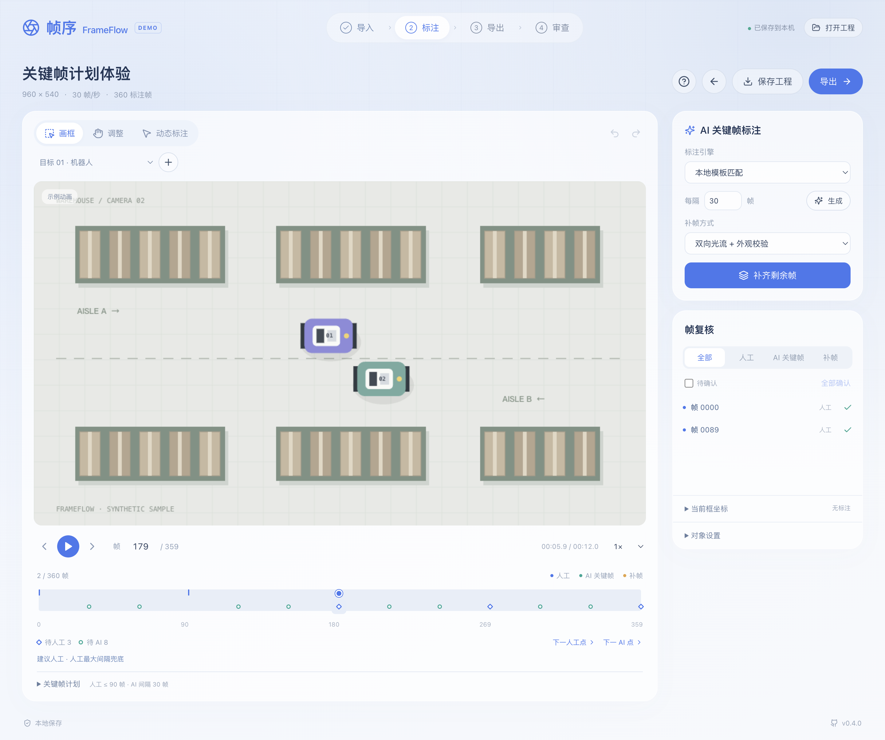

# 帧序 FrameFlow

本地优先的视频/图像标注 demo。按「导入与设置 → 标注与复核 → 导出 → 可选审查」完成一个任务，审查后可返回导出下载结果。

先阅读 [产品大纲](docs/PRODUCT_OUTLINE.md) 和 [可用性修订清单](docs/USABILITY_AUDIT.md)。当前实现矩形框，「AI 关键帧标注」采用本地模板匹配；真实多模态模型通过后续插件接入。

## 下载后直接打开

**普通使用无需 Node、npm、Codex 或浏览器插件。** `打开帧序.html` 是随仓库提供的完整应用，已内嵌 React、图标、ZIP 库及全部内置标注模块，下载完成后可离线使用。使用 Chrome 或 Edge 打开。

Windows PowerShell：

```powershell
git clone --branch main https://github.com/renjianfeixiu/frameflow.git
cd frameflow
Start-Process ".\打开帧序.html"
```

Mac 终端：

```sh
git clone https://github.com/renjianfeixiu/frameflow.git
cd frameflow
open "打开帧序.html"
```

也可以双击 `打开帧序.html`、Windows 的 `启动帧序.cmd` 或 Mac 的 `启动帧序.command`。这些启动入口直接打开网页，不安装依赖、不启动本地服务。未安装 Git 时，在仓库页面点击 **Code → Download ZIP**，解压后双击网页即可。

后续更新，先用「保存工程」下载备份并关闭旧页面，然后在项目目录执行：

```powershell
git pull --ff-only
Start-Process ".\打开帧序.html"
```

Mac 更新同样使用 `git pull --ff-only`，再执行 `open "打开帧序.html"`。固定使用本次发布版可以运行 `git switch --detach v0.6.1-github`；回到最新版用 `git switch main`。

### 内置能力与工程保存

- 模板匹配 AI 关键帧、双向光流、线性插帧、20 种导出、文件回导与规则审查均已包含，普通使用无需手动启用或下载插件。
- 这里的「插件」指源码中的可扩展模块。真实多模态/SAM 服务尚未部署，不能把模板匹配当作已包含的大模型；后续接入真实模型时才会涉及模型权重或服务配置。
- 自动保存只保存当前浏览器中的工程元数据。直接打开文件时，缓存行为与浏览器、文件路径有关，移动网页或清理浏览器后可能无法恢复。重要任务请点击「保存工程」下载 `.frameflow.json`，原视频或图像单独保留。
- 恢复工程后如果没有原视频，重新选择同一素材；工程备份不包含原媒体。
- 网页打不开时，用 Chrome/Edge 的「打开文件」选择它。浏览器支持的媒体编码仍有区别，无法读取的素材可转为兼容的 MP4/WebM 或 PNG/JPG。

### 修改源码时的开发入口

只有开发、运行测试或重新打包时才需要 **Node.js ≥22.18**。安装依赖会依据 `package-lock.json` 一次安装全部源码依赖，不需要另装这些内置插件。

```powershell
npm.cmd ci
npm.cmd start
```

Mac/Linux 使用 `npm ci`、`npm start`。开发服务位于 `http://127.0.0.1:5178/`，终端保持运行，`Ctrl+C` 停止。已有服务占用端口时，可用 `npm start -- --port 5179`。生产构建：

```sh
npm run build
npm run preview
```

`npm run build` 同时更新普通网页构建和独立的 `打开帧序.html`；独立网页与源码一致性、离线视频标注/导出都由 Windows、Mac、Linux CI 检查。当前提供网页便携版，没有 `.exe` / `.app` 安装包。

## 项目安排

- [产品迭代路线](docs/ROADMAP.md)：已完成操作与顺序复核修订，后续验证数据可靠性、模型辅助与真实场景试用。
- [GitHub 分类与工作流](docs/GITHUB_WORKFLOW.md)：Issue、标签、里程碑、分支、PR 和 Release 怎么配合。
- [参与开发](CONTRIBUTING.md) · [版本记录](CHANGELOG.md) · [跨平台检查](https://github.com/renjianfeixiu/frameflow/actions/workflows/ci.yml)。

当前版本为 **v0.6.1**：新增克隆后直接打开的独立网页，包含第二步类别与对象管理、多对象批处理、同一帧同类别连续画框，以及「人工复核 → AI 生成与复核 → 补帧与复核」的顺序流程。保留 v0.6 的标注与复核逻辑，内置算法随便携网页一起打包。



## 先体验一个完整任务

1. 点击「试用示例视频」，在「帧切分」选择标注帧率，例如 20 帧/秒，点击「开始标注」。原视频参数可展开确认。
2. 选择「新框类别」，在紫色机器人外拖出一个矩形框；同一帧接着给另一个机器人画框，会自动新增独立对象。同一帧画框用于新增对象，调整模式用于修改已有框；下一帧画框延续当前对象。时间线空心菱形表示待人工点、空心圆表示待 AI 点；点击点位跳帧，在「关键帧计划」调整人工最大间隔。
3. 右侧「帧复核流程」共用一个「全部对象 / 当前类别 / 当前对象」范围。先检查人工框，点击「确认人工关键帧」进入 AI；设置 AI 间隔，生成候选并逐条/批量确认或拒绝，然后点击「完成 AI 复核」进入补帧。没有候选时可明确选择仅用人工帧、跳过 AI；缺人工框或锁定对象会明确跳过。
4. 人工与 AI 两步完成后，选择「双向光流 + 外观校验」或「线性插帧」，点击「生成补帧」，在同一面板复核结果。修改人工关键帧会使该对象退回人工复核；修改 AI 候选会退回 AI 复核，其他对象的完成记录保留。
5. 选 COCO / YOLO 等格式下载 ZIP；默认仅导出已确认结果。若要训练，选择打包帧图像，或自行准备相同尺寸与命名的原帧。
6. 可进入第四步「AI 标注审查」，运行本地一致性检查，点击疑点回看或去修正；也可跳过审查直接下载。有效审查报告随 ZIP 打包。

帧切分决定整个任务的帧率。例如原视频 60 帧/秒、标注 20 帧/秒：一秒有 20 个标注帧，连续编号 0–19，取原视频第 0、3、6…57 帧。第二步帧号、动态录制、补帧、导出与回导都使用同一时间线；导出不再单独设置采样率。AI 关键帧间隔只决定这些标注帧中多久生成一个候选，是独立参数。开始产生标注后帧率锁定；新任务可重新选择。

动态标注：在第二步切换「动态标注」并设置框宽高 → 播放 → 按住鼠标跟随目标，松开停止。录制期间所有标注帧连续写入，没有帧间隔；浏览器显示跳帧时按相邻鼠标样本重采样轨迹。每次录制可整体撤销。固定框以原图像素计，可「取当前框」的尺寸。

## 已实现

- 单视频、单图像导入，内置 12 秒动画示例。
- 第一、二步可管理类别名称、颜色、新增与删除；已有标注的类别需选择迁移类别，框与轨迹保留。类别名不能重复，至少保留一个类别。
- 第一步可同时选择素材与标注文件，复用第二步播放器浏览、逐帧检查和继续修改。全部 20 种导出 ZIP 可精确回导；另外可直接读 COCO、CVAT XML、YOLO / Darknet、VOC、LabelMe JSON、MOT、帧序 CSV。
- 播放、速度调整、帧号、逐帧跳转、时间线。
- 同类别可画多个独立对象；新框类别与已有对象类别分开。画矩形、四角调整、缩放/平移、统一应用数字坐标、跨帧/对象复制粘贴。对象可改名、改类别、锁定/隐藏、设置出现区间；删除或缩短区间前显示影响数量，可撤销。
- 第二步配置固定框；播放中按住鼠标连续记录每个标注帧。
- 时间线显示可点击的人工/AI 建议点，支持逐点跳转和按当前目标重算。人工点默认最大间隔 3 秒、可调；均匀计划或已有低匹配分数/拒绝信号优先，两者都保证计划中的人工点间隔不超过上限。只有实际人工框完成相应人工点，确认 AI 不能替代。
- 按人工框进行实际像素模板匹配，按计划生成待确认候选。生成与补帧支持三个明确范围、逐对象结果与跳过原因，失败隔离、进度和原子取消。
- 可选双向金字塔 LK 光流或线性插帧；前者逐帧读取像素、检查外观，跟丢停止；后者仅插值确认锚点间的坐标。拒绝帧阻断传播。
- 人工复核 → AI 生成与复核 → 补帧与复核三个可见步骤，共用范围和列表。底层批任务也检查先后顺序；当前阶段内支持状态筛选、下一待确认、20 项分页、单条/批量确认与拒绝、拒绝恢复。工程 JSON 保留与内容匹配的阶段完成记录，撤销可恢复原进度。
- 自动生成默认保留已有结果；可选择更新未确认候选，始终保护人工、确认和拒绝记录。
- 50 步撤销/重做；合并写入的自动保存与离页保存；保存失败提示备份；工程 JSON 备份/恢复；有标注时替换任务先提示保留或备份。
- 20 个实际矩形框导出适配器：COCO、YOLO 两种布局、VOC、CVAT 图像/视频、Datumaro、LabelMe JSON/XML、VIA、Label Studio、Create ML、Open Images、KITTI、WIDER Face、ICDAR 两个版本、MOT、CSV、工程 JSON。详见 [格式矩阵](docs/EXPORT_FORMATS.md)。
- 浅蓝渐变、圆角、留白的四步页面；常用操作直接显示，说明与坐标编辑可展开。
- 可跳过的第四步审查：轨迹内部缺帧、位置/尺寸跳变、低匹配分数和待确认标注；疑点逐帧定位、人工处理、报告下载，修改标注后旧报告失效。

## 已知边界

- 多模态模型/SAM 系列尚未部署；本地模板与光流不是大模型，相关性不是准确率。示例效果不能代表真实视频效果。
- 审查当前运行本地规则，不是多模态语义识别；只检查已有轨迹内部，不能证明无未知目标漏标或类别错误。审查处理状态在本轮会话中保留，通过 JSON/ZIP 留存；刷新后可重新审查。
- 浏览器不能可靠读取所有源视频的实际 FPS；必须由用户确认。帧号按恒定 FPS 推算，可变帧率的精确时间戳将在后端抽帧阶段实现。
- 最多 18,000 个标注帧、图像最多 2400 万像素；一次 AI 关键帧生成最多 600 个候选；JPEG 打包最多 1000 帧且总像素≤6亿，更多可仅导出标注。
- 光流用角点、前后向检查、鲁棒位移/轻微尺度与人工模板校准，仍可能漂移；不处理复杂遮挡后的重识别。人工纠错与真实视频评估仍是必要环节。
- 修改人工框只清除附近依赖它的未确认派生结果，保留已确认框、其他对象及其他区间；邻近区间需重新生成。更换补帧算法时勾选「更新未确认候选」可替换旧待复核补帧，已确认框仍保留。
- 建议点是计划，仍需人实际完成；当前不强制锁住整个后续流程。质量优先只参考已有候选，不进行额外场景识别，也不把相关性阈值当成准确率。拒绝记录保留，AI 不跨拒绝帧传播；后续实际人工参考框可以恢复生成。
- 首轮导出覆盖 bbox 子集，不包含 mask、polygon、skeleton；外部目标软件往返兼容尚未实测。
- 自动保存只保存工程元数据。恢复真实媒体工程时，需重新选择相同的原素材。
- 首步「选择标注文件」可直接打开 ZIP，无需解压。工程格式保留全部状态；其他格式的清单只包含实际导出的标注。真实媒体需要配对原素材，尺寸与时长不符时拒绝关联。
- 原生图像格式没有轨迹身份时，每个框独立保留，不自动推断同一目标。文件名 `frame_000000` 或纯数字为从 0 开始的帧号；COCO 无此命名时按 images 列表顺序，MOT 按其 1 起始帧号换算。CVAT 原生稀疏轨迹按关键帧线性展开；此行为只用于解释原文件，补帧方式仍可另选光流。

## 开发与扩展

```sh
npm ci          # 开发前安装锁定依赖
npm test        # 核心数据、质量状态、格式和图像跟踪检查
npm run build  # TypeScript + 生产构建 + 独立 HTML
npm run smoke  # 实际启动并检查开发服务，然后关闭测试服务
npx playwright install chromium --only-shell # 仅开发验收需要的浏览器
npm run smoke:portable # 离线 file:// 实际操作验证
npm run portable:check # 检查已提交的 HTML 与源码一致
npm run format # 格式化源码
```

目录：`src/core` 统一数据、文件回导与不变量，`src/media` 帧读取，`src/plugins` 导入/辅助/补帧/导出/审查接口，`src/components` 四步界面，`src/hooks` 工程与历史。新增插件在注册表注册；详见 [插件说明](docs/PLUGINS.md)。

## 版本与回滚

GitHub `main` 当前承载 v0.6.1，本次发布标签为 `v0.6.1-github`，包含独立网页与跨平台离线验收。首个发布标签 `v0.4.0-demo` 保留。详见 [版本记录](CHANGELOG.md)。

仓库原内容已保存在 `codex/archive-before-frameflow-20261007` 分支；本次在已有历史上提交替换，不使用强制推送。

- `v0.4.0-demo`：类别删除与迁移、时间线建议点、人工最大间隔及统一 AI 点位计划，首个跨平台发布快照。
- `v0.6.0-github`：类别/对象管理、多对象批处理、安全覆盖、四角调整、复制粘贴、自动保存保护；同帧连续画框创建同类独立对象；人工 → AI → 补帧顺序复核、任务前置校验、编辑回退与工程阶段恢复。
- `v0.6.1-github`：全部运行依赖内嵌为独立网页，克隆或下载后双击即可离线使用；跨平台 CI 验证网页与源码同步，并实际操作视频标注、光流、导出和工程恢复。

只查看本次发布版：`git switch --detach v0.6.1-github`；回到最新版：`git switch main`。保留历史并撤销某次改动可使用 `git revert <提交号>`。

[产品大纲](docs/PRODUCT_OUTLINE.md) · [可用性修订](docs/USABILITY_AUDIT.md) · [插件说明](docs/PLUGINS.md) · [验收记录](docs/VERIFICATION.md) · [软著申请大纲](docs/SOFTWARE_COPYRIGHT_OUTLINE.md)
